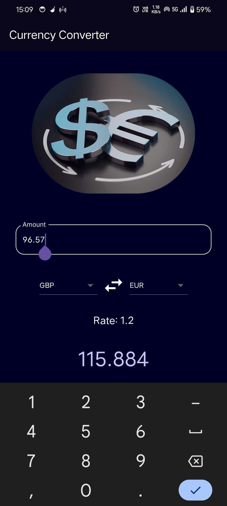

# Currency Converter with Flutter💸

Simple application to convert currency denominations from one to another instantly, by fetching real-time conversion rates through API.

## Features

- Straightforward UI
- Instant conversion
- Real-time rates fetched through an API

## Screenshot



## Technical Overview

- Uses basic state management using setState() and initState()
- Flutter Widgets: TextField, Icon
- Conversion rates fetched through API
- Manual math logic for result calculation

## Future Enhancements

To integrate more currencies.

## Installation and Setup

### Prerequisites

- [Flutter SDK](https://flutter.dev/docs/get-started/install) installed on your machine.
- An editor like [Android Studio](https://developer.android.com/studio) or [Visual Studio Code](https://code.visualstudio.com/).

To run this project on your local machine, follow these steps:

1. **Clone the Repository**:
    ```bash
    git clone https://github.com/dshryn/currency_converter.git
    cd currency_converter
    ```

2. **Install Dependencies**:
    ```bash
    flutter pub get
    ```

3. **Run the App**:
    ```bash
    flutter run
    ```
    
## Additional Information

### Dependencies

```yaml
dependencies:
  flutter:
    sdk: flutter
  cupertino_icons: ^1.0.6
  http: ^1.2.1

